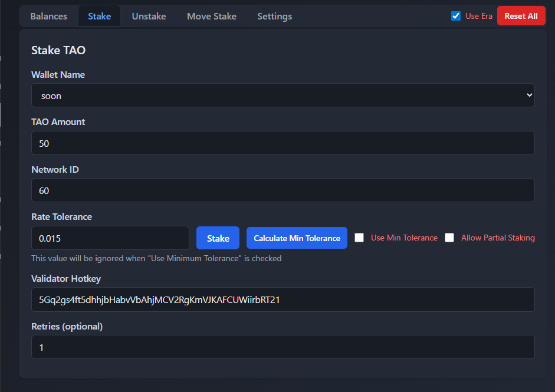

# Overview

Proxy for Bittensor Staking - Ensuring 100% confidence and security for Subnet alpha token traders

Bots list which can be found here:
    https://github.com/alpha-trading-com/bots

# How to use

## Introduction
To improve wallet security, we recommend using a proxy wallet for routine operations such as staking and unstaking. Because these actions are performed frequently, the proxy wallet’s password or seed phrase may face higher exposure risk over time. The proxy pattern helps reduce the impact by limiting what the proxy wallet can do.

Because of the following mechanizm.

For transfers of TAO to another wallet, please use an approval flow instead of transferring directly from the proxy. Create a transfer proposal and share the call hash with the approver wallets. Once the approvers review and approve the proposal, the transfer can be executed.

For best security, please keep the approver wallets’ seed phrases strictly confidential and stored using strong security practices.

## Installation

```git clone https://github.com/alpha-trading-com/staking.git```

```cd staking```

```python3 -m venv .venv```

```source .venv/bin/activate```

```pip3 install -r requirements.txt```

## Configure environment variables

Create a `.env` file in the root directory with the following variables:

```bash
# Network Configuration
NETWORK=finney
DELEGATOR=<multisig_wallet_address>
PROXY_WALLET=<your_wallet_name>
APPROVER=<approver_address> (another signatory of the multisig address)
```

Edit `app/core/config.py`
```
    WALLET_NAMES: List[str] = ["soon"]
    DELEGATORS: List[str] = ["5CsiGTsNBAn1bNiGNEd5LYpo6bm3PXT5ogPrQmvpZaUb2XzZ"]
    ADMIN_HASH: str = "$2b$12$CqCJKab8CIgqnPU/.eT41.kzdl4d6a3/Vx70R50GAom7Im0tjGemm"
```
Here `ADMIN_HASH` is your passwords hash.

After that, run `run_multisig.sh`.
This will prompt your proxy wallet name and enter your proxy wallet name.

You will see the following screenshot after successful setup.



## Add proxy

You need to add proxy to your delegator address.

```python3 multisig.py```

It will prompt you to select action type. Select `proxy`.

Then you need to input proxy address you want to add. If you want to add your wallet as a proxy, just type `self` and type your wallet password.

Then you need to select proxy type. Currently we support staking and registration. Select `staking`.

Making a transaction with multisig account involves two step.

The first step is you propose a transaction and the second step is the approver approves the proposed transaction.

It will display `call_hash` and `call_data` before asking you to enter your wallet password.

If you enter your password correctly, it will create a transaction proposal successfully.

Note that you need to hold some balance (at least 0.2 ~ 0.3 TAO) because multisig transaction proposal requires to lock some funds temporarily before the transaction gets approved. After successful approval, it will release the locked funds.

After successful transaction proposal, just copy `call_data` and send it to the approver so he can approve the proposed transaction.

Once the approver approves the proposed transaction, you should be able to make staking tansactions (including `add_stake`, `remove_stake`, and `swap_stake`) on behalf of delegator address.

## Do alpha trading with proxy address

First, you need to set environment variables by doing the below:

```cp .env.example .env```

Edit `.env` with your own environment variables.

Now you can run `proxy.py` script to make trading operations.

```python3 proxy.py --help```

You can see available commands in `proxy.py`.

You can do three types of operations – add, remove, and swap.

```python3 proxy.py addstake --help```

```python3 proxy.py removestake --help```

```python3 proxy.py swapstake --help```

## Transfer balance from multisig account

This process is similar with `add_proxy` process.

Just run `python3 multisig.py` and select `transfer` as action type.

Then enter the required inputs and propose a transfer transaction.

You just need to send `call_data` to the approver so he can approve the transfer transaction.

That's it!

# Cautions
- Moving stake is similar to setting a high tolerance, making your transactions vulnerable to MEV bots. To minimize risk, avoid moving stake unless absolutely necessary.

# Buy me a coffee!

Just follow me on GitHub and star this repo. Thank you!
